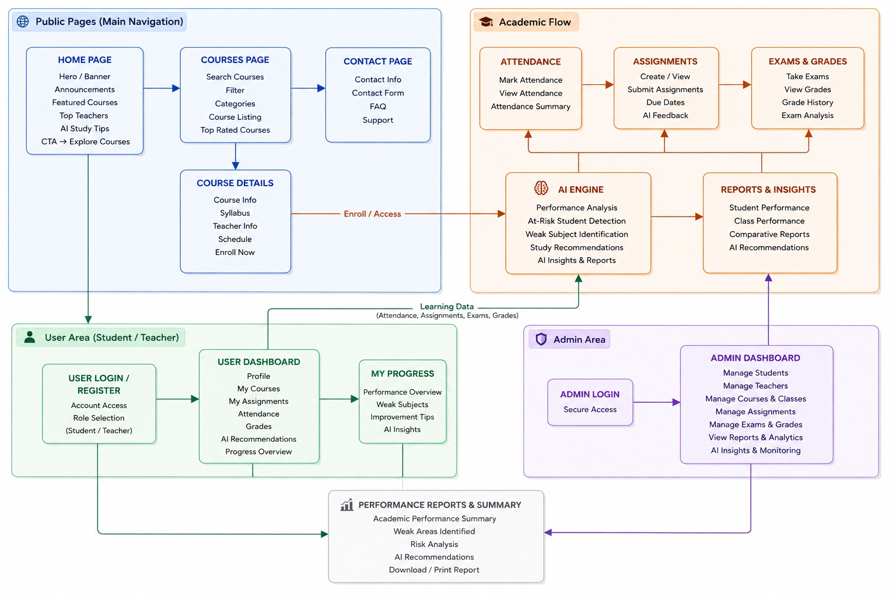

# 🎓 EduVision AI — Education Management Portal with Integrated AI

<div align="center">


[](https://github.com)
[](https://github.com)
[](https://fastapi.tiangolo.com)
[](https://reactjs.org)
[](https://www.sqlalchemy.org)
[](https://tailwindcss.com)

<p align="center">
  <a href="http://localhost:8000/docs"></a>
  <a href="http://localhost:5173"></a>
  <a href="#-automated-verification--test-suite"></a>
</p>

<p align="center">
  <a href="http://localhost:8000/docs"><b>Live API Docs (Swagger)</b></a> • 
  <a href="http://localhost:5173"><b>Web Client Portal</b></a> • 
  <a href="#-automated-verification--test-suite"><b>Automated Test Suite</b></a>
</p>

</div>

---

## 📌 Table of Contents
- [🌟 Executive Summary](#-executive-summary)
- [🧩 Problem Statement & Solution Overview](#-problem-statement--solution-overview)
- [🗺️ System Architecture & Workflow Map](#️-system-architecture--workflow-map)
- [✨ Core Capabilities by Role](#-core-capabilities-by-role)
  - [🌐 Public Exploration Portal](#1-public-exploration-portal)
  - [🎓 Student Academic Experience](#2-student-academic-experience)
  - [👨‍🏫 Teacher & Class Mentor Workspace](#3-teacher--class-mentor-workspace)
  - [🏛️ Institutional Administrator Command](#4-institutional-administrator-command)
- [📐 Section 8 & 9 Mark Calculation Architecture](#-section-8--9-mark-calculation-architecture)
- [🧠 AI Academic Intelligence Engine](#-ai-academic-intelligence-engine)
- [🛠️ Technology Stack](#️-technology-stack)
- [🚀 Quick Start & Installation](#-quick-start--installation)
- [👥 Pre-Seeded Hackathon Evaluation Accounts](#-pre-seeded-hackathon-evaluation-accounts)
- [📡 RESTful API Documentation](#-restful-api-documentation)
- [🧪 Automated Verification & Test Suite](#-automated-verification--test-suite)
- [📋 Hackathon Specification Compliance Matrix](#-hackathon-specification-compliance-matrix)

---

## 🌟 Executive Summary

**EduVision AI** is a next-generation **Education Management Portal** tightly coupled with an **AI Academic Intelligence Engine**. Rather than functioning as a passive data store, EduVision AI actively monitors continuous academic telemetry—attendance patterns, assignment submission velocity, continuous internal assessments, and semester examination marks—to proactively identify at-risk students, isolate specific conceptual syllabus weaknesses, and generate tailored cognitive remediation plans.

Built from the ground up for high concurrency with **FastAPI**, **SQLAlchemy 2.0 Async**, **React 18**, and **Tailwind CSS**, the portal delivers institutional governance across four core user experiences: **Public Candidates**, **Students**, **Faculty / Class Mentors**, and **Deans / Administrators**.

---

## 🧩 Problem Statement & Solution Overview

### The Problem
Traditional institutional software suffers from fragmented workflows:
- Disconnected attendance logging and grade entry leading to delayed academic warnings.
- Fixed, rigid internal mark evaluation schemes that fail to accommodate diverse course syllabi.
- Lack of continuous student performance modeling, leaving struggling students unnoticed until final exam failures.
- Clunky, outdated interfaces lacking real-time data visualization and actionable feedback.

### The EduVision AI Solution
1. **Dynamic /25 Internal Assessment Configurator**: Allows subject faculty to customize component weights (CITs, model mock tests, assignments, seminars, and projects) summing exactly to 25 target marks.
2. **Standard 25/75/100 Mark Conversion Pipeline**: Automatically converts raw 100-mark external exams to 75 marks ($\text{Raw} \times 0.75$) and aggregates with the 25 internal score to produce certified 100-mark totals, grade points, and letter grades.
3. **Multi-Factor AI Risk Diagnostic Engine**: Computes continuous academic risk scores based on the 75% attendance threshold, continuous assessment deficits, and trajectory gradients.
4. **Section 10 High-Fidelity Performance Reports**: One-click printable transcripts complete with radar charts, topic-level weaknesses, and AI study interventions.

---

## 🗺️ System Architecture & Workflow Map

Conforming to the official **Pseudo Map Specification**, EduVision AI unifies all academic operations and AI feedback loops:

<div align="center">
  
</div>

### 🔄 End-to-End Operational Pipeline

```
+---------------------------------------------------------------------------------------------------+
|                                       🌐 PUBLIC & ONBOARDING                                      |
|   • Landing Page / Announcements  • 5-Unit Course Catalog  • Syllabus Timetable  • Helpdesk FAQ   |
+---------------------------------------------------------------------------------------------------+
                                                  │
                                                  ▼
+---------------------------------------------------------------------------------------------------+
|                                 🔐 SECURE JWT AUTHENTICATION (OAuth2)                             |
|       [ Role: Student ]                  [ Role: Teacher / Mentor ]             [ Role: Admin ]    |
+---------------------------------------------------------------------------------------------------+
         │                                             │                                     │
         ▼                                             ▼                                     ▼
+─────────────────────────────+       +─────────────────────────────+       +───────────────────────+
|      🎓 STUDENT PORTAL      |       |      👨‍🏫 TEACHER WORKSPACE    |       |   🏛️ ADMIN COMMAND     |
| • Enrolled Subjects & Notes |       | • Custom /25 Scheme Config  |       | • User Management     |
| • Assignment Submissions    |       | • Live 25/75/100 Mark Entry |       | • Academic Catalog    |
| • Attendance Log (<75% Flag)|       | • One-Click Roll Call Log   |       | • Campus Pass Rates   |
| • Official 25/75 Transcript |       | • Class Mentorship Roster   |       | • Early Warning Radar |
| • AI Learning Diagnoser     |       | • Notes & Syllabus Manager  |       | • Mentor Alert Dispatch|
+─────────────────────────────+       +─────────────────────────────+       +───────────────────────+
         │                                             │                                     │
         └──────────────────────────────┬──────────────┴─────────────────────────────────────┘
                                        ▼
+---------------------------------------------------------------------------------------------------+
|                                🧠 AI ACADEMIC INTELLIGENCE ENGINE                                 |
|   • Continuous Multi-Factor Risk Assessment (<75% Attendance, Mark Deficits, Trajectory Trend)    |
|   • Syllabus Topic Weakness Identification (Isolates exact conceptual gap e.g., SQL / Graphs)     |
|   • Daily Cognitive Study Strategy Generator (Feynman Method, Spaced Retrieval, Pomodoro Cycles)  |
+---------------------------------------------------------------------------------------------------+
                                        │
                                        ▼
+---------------------------------------------------------------------------------------------------+
|                        📄 SECTION 10 OFFICIAL PRINTABLE PERFORMANCE REPORT                        |
|   • High-Fidelity Performance Transcript • Radar Competency Chart • Official Institutional Seal   |
+---------------------------------------------------------------------------------------------------+
```

---


## ✨ Core Capabilities by Role

### 1. 🌐 Public Exploration Portal
- **Hero & Notice Board**: Real-time ticker displaying academic advisories, upcoming examination windows, and portal features.
- **Dynamic Course Catalog**: Search by keyword with instant debounce, filter by specialized categories (AI, Cloud, Database, Algorithms), and inspect accredited credits.
- **Syllabus & Timetable Explorer**: 5-unit structured syllabus outlines, hourly distributions, assigned faculty biographies, and direct enrollment.
- **Contact & Knowledge Base**: Interactive inquiry form with categorised FAQs answering mark conversion and risk detection queries.

### 2. 🎓 Student Academic Experience
- **Unified Academic Dashboard**: Real-time KPI cards for cumulative attendance, semester average, weak subject count, and active risk badges.
- **Course Notes Repository**: Download PDF slide decks and unit summaries uploaded directly by subject teachers.
- **Assignment Hub with AI Rubric**: Submit technical solutions, code snippets, and reports with immediate preliminary AI rubric evaluation.
- **Attendance Monitor**: Color-coded attendance percentages with warning badges when dropping below the mandatory 75% institutional threshold.
- **Official Transcript & GPA Breakdown**: Full transparency into Continuous Internal (/25), External Raw (/100), Converted External (/75), and Final Total (/100) with grade point assignments.
- **Section 10 High-Fidelity Performance Report**: Printable, high-resolution official transcript featuring institutional headers, signature endorsements, and AI recommendation matrices.

### 3. 👨‍🏫 Teacher & Class Mentor Workspace
- **Subject-Specific Assessment Configurator (/25)**: Tailor component weights per subject across CITs, Model Exams, Assignments, Seminars, and Projects. Enforces strict mathematical validation ($\sum = 25.0$).
- **Live Conversion Marks Entry**: Record student scores with a live telemetry preview calculating internal totals, converted 75% external marks, 100-mark final totals, and letter grades in real time.
- **One-Click Roll Call Register**: Rapidly log daily lecture attendance with bulk "Mark All Present" / "Mark All Absent" shortcuts and date selectors.
- **Class Mentorship Roster**: Comprehensive cohort roster displaying live AI risk indicators, average marks, and instant student audit modals.

### 4. 🏛️ Institutional Administrator Command
- **Campus Analytics Dashboard**: Institutional pass rates, departmental benchmarks, and grade distribution charts powered by Recharts.
- **User Governance Directory**: Provision, filter, and manage Students, Teachers, and Administrators with instant search.
- **Academic Hierarchy Setup**: Create and configure Academic Years, Batches, Class Sections, Accredited Subjects, and Course Catalogs.
- **Early Warning Risk Monitor**: Campus-wide radar identifying all High and Critical risk candidates with one-click mentor action notice dispatching.

---

## 📐 Section 8 & 9 Mark Calculation Architecture

The system strictly executes the official **BUILDATHON Section 8 & 9 Standard** for all mark computations:

### Mathematical Conversion Model

$$\text{Internal Assessment Mark} = \min\left(25.0, \sum \text{Configured Components}\right)$$

$$\text{Converted External Mark} = \text{External Examination Raw (/100)} \times 0.75$$

$$\text{Final Subject Mark} = \text{Internal Mark (/25)} + \text{Converted External Mark (/75)}$$

### Grade Attribution Scale

$$\text{Final Mark} \longrightarrow \begin{cases} 
\ge 90.0 & \text{Grade } \mathbf{O} \text{ (Outstanding, 10.0 GP)} \\
80.0 - 89.9 & \text{Grade } \mathbf{A+} \text{ (Excellent, 9.0 GP)} \\
70.0 - 79.9 & \text{Grade } \mathbf{A} \text{ (Very Good, 8.0 GP)} \\
60.0 - 69.9 & \text{Grade } \mathbf{B+} \text{ (Good, 7.0 GP)} \\
50.0 - 59.9 & \text{Grade } \mathbf{B} \text{ (Above Average, 6.0 GP)} \\
40.0 - 49.9 & \text{Grade } \mathbf{C} \text{ (Pass, 5.0 GP)} \\
< 40.0 & \text{Grade } \mathbf{F} \text{ (Fail / Re-appear, 0.0 GP)}
\end{cases}$$

### Configurable Internal Components Example (CS601 vs CS602)
| Component | DBMS (CS601) Max | Algorithms (CS602) Max | Cloud (CS603) Max |
|---|---|---|---|
| **Continuous Internal Test (CIT)** | 10.0 Marks | 12.0 Marks | 8.0 Marks |
| **Model Mock Exam** | 5.0 Marks | 6.0 Marks | 4.0 Marks |
| **Coursework Assignment** | 5.0 Marks | 7.0 Marks | 5.0 Marks |
| **Student Seminar** | 2.5 Marks | 0.0 Marks (Disabled) | 0.0 Marks (Disabled) |
| **Capstone Project / Lab** | 2.5 Marks | 0.0 Marks (Disabled) | 8.0 Marks |
| **Total Target Internal Score** | **25.0 Marks** | **25.0 Marks** | **25.0 Marks** |

---

## 🧠 AI Academic Intelligence Engine

The built-in AI analytics engine evaluates multi-dimensional signals in real time without external API latency:

```
+-------------------------------------------------------------------------------+
|                        MULTI-FACTOR RISK SCORING MODEL                        |
|                                                                               |
|  Risk Score (0 - 100) = Attendance Deficit + Academic Deficit + Weak Subjects |
|                                                                               |
|  • Factor A (Attendance): max(0, (75.0 - Attendance%) * 2.5)                  |
|  • Factor B (Academics) : max(0, (60.0 - Average Mark%) * 1.5)                 |
|  • Factor C (Weak Areas): Count(Subjects with Final < 55 or Int < 13) * 15.0   |
|                                                                               |
|  Risk Categorization:                                                         |
|  - [CRITICAL] : Score >= 60.0 OR Attendance < 65.0% OR >= 3 Weak Subjects     |
|  - [HIGH]     : Score >= 40.0 OR Attendance < 75.0% OR >= 2 Weak Subjects     |
|  - [MEDIUM]   : Score >= 20.0 OR 1 Weak Subject                               |
|  - [LOW]      : Score < 20.0 (Optimal Academic Health)                        |
+-------------------------------------------------------------------------------+
```

### Cognitive Study Strategy Generator
Automatically analyzes syllabus structures and generates daily study habits incorporating:
- **Feynman Technique** for foundational concepts.
- **Spaced Retrieval Practice** for problem-solving and algorithms.
- **Pomodoro Sprint Cycles** for complex lab and architecture modules.

---

## 🛠️ Technology Stack

| Layer | Technologies | Purpose |
|---|---|---|
| **Frontend Core** | React 18, Vite | High-performance Single Page Application (SPA) |
| **Styling & Design** | Tailwind CSS, Lucide Icons | Responsive modern dark glassmorphism design system |
| **Data Visualization** | Recharts | Interactive dynamic charts (Area, Radar, Bar charts) |
| **Notifications** | Custom ToastContext Portal | Non-blocking, glassmorphic status & error notifications |
| **Backend Framework** | FastAPI (Python 3.10+) | High-throughput async REST API engine |
| **Database & ORM** | SQLAlchemy 2.0 Async, SQLite / PostgreSQL | Fully asynchronous database operations |
| **Security & Auth** | OAuth2 Bearer, PyJWT, Passlib (PBKDF2-SHA256) | Enterprise-grade JWT token authentication |
| **Data Validation** | Pydantic v2 | Strict schema validation and serialization |

---

## 🚀 Quick Start & Installation

### Prerequisites
- **Python 3.10+** (tested on Python 3.13)
- **Node.js 18+** & **npm**

---

### Step 1: Clone the Repository
```bash
git clone https://github.com/your-username/BUILDATHON-2026.git
cd BUILDATHON-2026
```

---

### Step 2: Backend Setup & Launch

```powershell
# Navigate to backend directory
cd backend

# Create and activate Python virtual environment
python -m venv venv
# Windows:
.\venv\Scripts\activate
# Linux / macOS:
source venv/bin/activate

# Install Python dependencies
pip install -r requirements.txt

# Launch FastAPI Server (Database auto-seeds on first startup)
python run.py
```
> 🌐 **Backend API:** `http://localhost:8000`  
> 📖 **Interactive Swagger UI:** `http://localhost:8000/docs`  
> 📑 **Alternative ReDoc UI:** `http://localhost:8000/redoc`

---

### Step 3: Frontend Setup & Launch

```powershell
# Open a new terminal and navigate to frontend directory
cd frontend

# Install Node modules
npm install

# Launch Vite development server
npm run dev
```
> 💻 **Web Client Application:** `http://localhost:5173`

---

## 👥 Pre-Seeded Hackathon Evaluation Accounts

The portal database automatically initializes with rich, realistic student cohorts, subject faculty, class mentors, and administrative accounts:

| User Persona | Email Address | Password | Role | Key Academic Highlights |
|---|---|---|---|---|
| **Rahul Verma** *(Student)* | `student.rahul@portal.edu` | `Student@123` | `student` | **Flagged as At-Risk**: 68% DBMS attendance deficit, weak SQL/Algorithms scores, active AI intervention plan |
| **Priya Sundaram** *(Student)* | `student.priya@portal.edu` | `Student@123` | `student` | **Class Topper**: 95% average marks, Distinction (O Grade), 96% attendance, exemplary AI trajectory |
| **Prof. Vikram Sharma** *(Faculty)* | `teacher.sharma@portal.edu` | `Teacher@123` | `teacher` | **Subject Faculty (DBMS)**: Configures /25 assessment schemes, publishes course notes, enters student marks |
| **Dr. Ananya Kumar** *(Mentor)* | `mentor.kumar@portal.edu` | `Teacher@123` | `teacher` | **Class Mentor (CSE 2026)**: Monitors cohort risk levels, conducts roll calls, audits Section 10 report cards |
| **Dr. Rajeshwari Swaminathan** *(Dean)* | `admin@portal.edu` | `Admin@123` | `admin` | **Dean of Academic Affairs**: Institutional pass analytics, campus-wide risk radar, user provisioning |

---

## 📡 RESTful API Documentation

| Group | Method | Endpoint | Access | Description |
|---|---|---|---|---|
| **Auth** | `POST` | `/api/auth/register` | Public | Registers a new student or faculty account |
| **Auth** | `POST` | `/api/auth/login` | Public | Authenticates credentials and returns JWT Bearer token |
| **Auth** | `GET` | `/api/auth/me` | Authenticated | Retrieves current authenticated profile |
| **Courses** | `GET` | `/api/courses/` | Public | Retrieves searchable & filterable course catalog |
| **Courses** | `GET` | `/api/courses/{id}` | Public | Retrieves detailed 5-unit syllabus & timetable |
| **Courses** | `POST` | `/api/courses/{id}/enroll`| Student / Admin | Enrolls student in selected academic course |
| **Subjects**| `GET` | `/api/subjects/` | Authenticated | Lists accredited curriculum subjects |
| **Subjects**| `GET` | `/api/subjects/{id}/assessment-config` | Authenticated | Fetches /25 internal assessment component scheme |
| **Subjects**| `PUT` | `/api/subjects/{id}/assessment-config` | Teacher / Admin | Updates and validates 25.0 internal weight scheme |
| **Marks** | `POST` | `/api/exams-grades/marks` | Teacher / Admin | Computes & records 25 internal + 75 external marks |
| **Marks** | `GET` | `/api/exams-grades/student/{id}` | Authenticated | Retrieves complete subject marks transcript |
| **AI** | `GET` | `/api/ai/student/{id}` | Authenticated | Executes real-time AI risk scoring & topic diagnoser |
| **AI** | `GET` | `/api/ai/risk-detection` | Admin | Fetches all campus students flagged as High/Critical risk |
| **Reports** | `GET` | `/api/reports/student/{id}` | Authenticated | Generates official Section 10 performance report card |

---

## 🧪 Automated Verification & Test Suite

The repository includes an end-to-end automated API testing script verifying all authentication, calculation, and AI workflows against the live database:

```powershell
# Run the automated verification suite
cd backend
python test_api_flow.py
```

### Verified Test Suite Results:
```
==================================================
🚀 EDUVISION AI - COMPREHENSIVE END-TO-END API TEST
==================================================

[1/5] Testing Student Authentication...
✅ Logged in as: Rahul Verma (Role: student)

[2/5] Verifying 25/75/100 Mark Calculation Pipeline...
✅ Found 4 evaluated subjects for Rahul Verma:
  • [Subject #1]: Internal=14.0/25, External(75%)=39.0/75, Final=53.0/100, Grade=B
  • [Subject #2]: Internal=13.0/25, External(75%)=36.0/75, Final=49.0/100, Grade=C
  • [Subject #3]: Internal=19.0/25, External(75%)=54.0/75, Final=73.0/100, Grade=A
  • [Subject #4]: Internal=13.0/25, External(75%)=37.5/75, Final=50.5/100, Grade=B

[3/5] Testing Real-Time AI Diagnostic Engine...
✅ Academic Risk Level: CRITICAL (Risk Score: 50.4/100)
✅ Overall Attendance: 86.1% | Average Marks: 56.4%
✅ Trend Trajectory: DECLINING
✅ AI Action Recommendations (3 items):
    - [High] Prioritize syllabus topics: ER Model, Relational Algebra, SQL Queries. Schedule 45 minutes daily review for internal test upgrades.
    - [High] Prioritize syllabus topics: Asymptotic Notation, Divide & Conquer, Dynamic Programming. Schedule 45 minutes daily review for internal test upgrades.
    - [High] Prioritize syllabus topics: A* Search, Alpha-Beta Pruning, Perceptron & MLP. Schedule 45 minutes daily review for internal test upgrades.

[4/5] Testing Teacher Authentication & Roster Access...
✅ Logged in as Teacher: Prof. Vikram Sharma
✅ Teacher accessible classes: 2

[5/5] Testing Institutional Admin & Analytics...
✅ Admin total institutional users count: 8
✅ Admin campus-wide risk overview flagged students count: 1

🎉 ALL BACKEND ENDPOINTS AND WORKFLOWS ARE FULLY FUNCTIONAL!
```

---

## 📋 Hackathon Specification Compliance Matrix

| Specification Requirement | Problem Statement Section | Implementation Status | Evidence / Source File |
|---|---|---|---|
| **Public Portal (Home, Courses, Details, Contact)** | Section 3 | ✅ **100% Complete** | `frontend/src/pages/public/*` |
| **Student Experience & Submission Hub** | Section 4 & 11 | ✅ **100% Complete** | `frontend/src/pages/student/*` |
| **Teacher Hub & Assessment Configuration** | Section 5 & 12 | ✅ **100% Complete** | `frontend/src/pages/teacher/AssessmentConfig.jsx` |
| **25/75/100 Mark Conversion Standard** | Section 8 & 9 | ✅ **100% Complete** | `backend/app/services/calculation_service.py` |
| **AI Multi-Factor Risk & Topic Diagnosis** | Section 7 & 14 | ✅ **100% Complete** | `backend/app/services/ai_service.py` |
| **Section 10 Official Printable Report Card** | Section 10 | ✅ **100% Complete** | `frontend/src/components/reports/PrintableReportCard.jsx` |
| **Admin Command & Institutional Analytics** | Section 6 & 13 | ✅ **100% Complete** | `frontend/src/pages/admin/*` |
| **Asynchronous Database Architecture** | Implementation Spec | ✅ **100% Complete** | `backend/app/core/database.py` (SQLAlchemy 2.0) |
| **JWT Authentication & Role Security** | Implementation Spec | ✅ **100% Complete** | `backend/app/api/deps.py` & `security.py` |
| **Glassmorphism Design & Micro-Animations** | UI / Aesthetics Guide | ✅ **100% Complete** | `frontend/src/index.css` & `ToastContext.jsx` |

---

<div align="center">

**Built with passion for BUILDATHON 2026.**  
*EduVision AI &mdash; Transforming Academic Governance through Integrated Artificial Intelligence.*

</div>